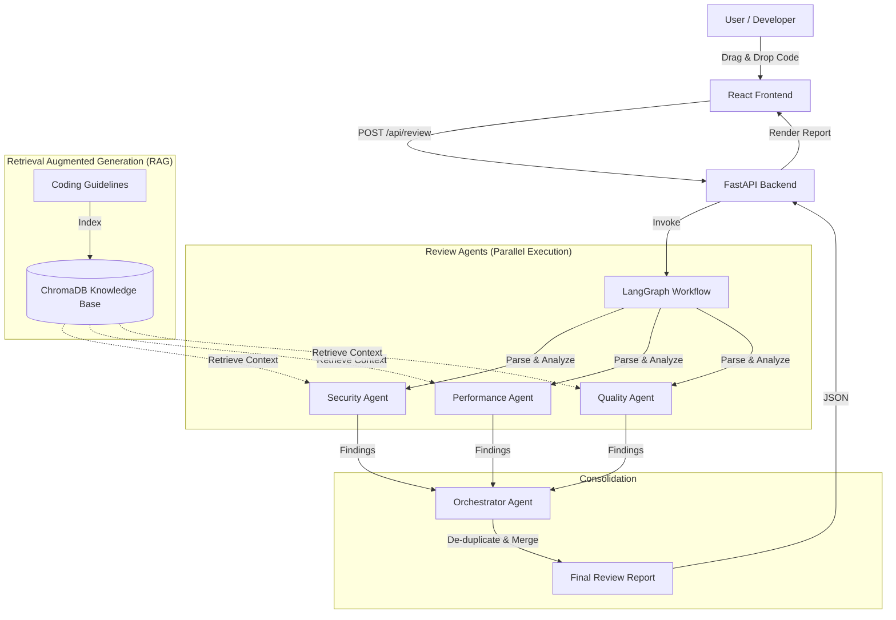

# Multi-Agent Code Reviewer

An intelligent, full-stack code review assistant powered by LLMs (OpenAI/Groq), LangGraph, and RAG. It employs multiple specialized agents to analyze code for security, performance, and quality issues, resolving conflicts to provide a unified, actionable report.

## 🏗️ Architecture

The system follows a micro-service inspired modular architecture where the Frontend acts as a client to the FastAPI backend, which orchestrates the multi-agent workflow.



## 🧩 Components

### 1. **Core Agents**
-   **Security Agent**: Focuses on vulnerabilities (SQLi, XSS, Secrets). Uses `bandit`-like logic and LLM reasoning.
-   **Performance Agent**: Identifies O(N^2) loops, resource leaks, and inefficient logic.
-   **Quality Agent**: Checks naming conventions, modularity, and code style.
-   **Orchestrator**: The "Team Lead" that merges findings, removes duplicates, and generates the executive summary.

### 2. **RAG Engine**
-   Uses **ChromaDB** to store coding guidelines and best practices.
-   Agents retrieve relevant documents (e.g., "OWASP Top 10" or "Python Optimization Tips") to ground their reviews.

### 3. **Tech Stack**
-   **Frontend**: React, Vite, Tailwind CSS (Dark Mode), Lucide Icons.
-   **Backend**: Python, FastAPI, Pydantic.
-   **AI Orchestration**: LangChain, LangGraph.
-   **LLM Support**: OpenAI (GPT-3.5/4) or Groq (Llama 3).

---

## 🚀 Getting Started

### Prerequisites
-   Python 3.9+
-   Node.js 18+
-   OpenAI API Key OR Groq API Key

### 1. Backend Setup
```bash
# Clone repository
git clone <repo-url>
cd multi-agent-code-reviewer

# Install Python dependencies
pip install -r requirements.txt
# OR if using poetry
poetry install

# Configure Environment
cp .env.example .env
# Edit .env and add your API keys (OPENAI_API_KEY or GROQ_API_KEY)
```

Run the server:
```bash
# Start FastAPI (Reload mode)
python3 -m uvicorn src.api.main:app --reload
```
API runs at: `http://127.0.0.1:8000`

### 2. Frontend Setup
```bash
cd frontend

# Install Node dependencies
npm install

# Start Dev Server
npm run dev
```
Frontend runs at: `http://localhost:5173`

## 🛠️ Configuration (LLM Provider)
You can switch between OpenAI and Groq by changing the `.env` file:
```bash
# Options: openai, groq, ollama
LLM_PROVIDER=groq
GROQ_API_KEY=gsk_...
```
Restart the backend after changing the provider.

## 📂 Folder Structure
-   `src/agents/`: Logic for individual agents.
-   `src/graph/`: LangGraph workflow definition.
-   `src/api/`: REST API endpoints.
-   `frontend/`: React application.
-   `data/knowledge_base/`: Markdown files for RAG.
